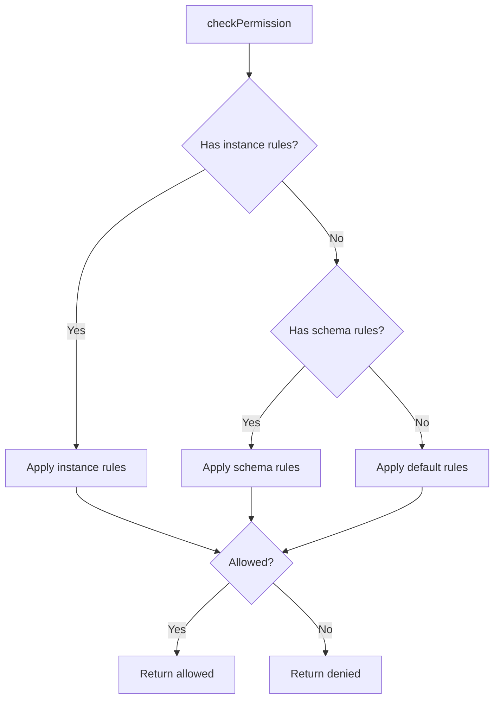

# Diagram Examples

Concrete examples of traces I produce.

## Example 1: Simple Function Trace

**Request**: Trace the login flow

**Output**:

```
login(email, password)
├─ validateInput(email, password)
│  ├─ !email → throw "Email required"
│  ├─ !password → throw "Password required"
│  └─ valid → continue
├─ user = findUserByEmail(email)
│  └─ !user → throw "User not found"
├─ match = comparePassword(password, user.hash)
│  └─ !match → throw "Invalid password"
├─ token = generateToken(user)
└─ return { user, token }
```

## Example 2: Expected vs Actual Comparison

**Request**: Debug why items appear in wrong order

**Output**:

```
## Expected Flow

addItem(item)
├─ items.push(item)
├─ sortByDate(items)        ← Should sort after add
└─ render(items)

## Actual Flow

addItem(item)
├─ items.push(item)
├─ render(items)            ← Renders BEFORE sort!
└─ sortByDate(items)        ← Sort happens after render

## Divergence

Lines 45-47 in ItemList.tsx:
The render() call happens before sortByDate().
Swap their order to fix.
```

## Example 3: Multi-Component Sequence

**Request**: Trace form submission through the system

**Output**:

```
┌─────────┐     ┌──────────┐     ┌─────────┐     ┌─────────┐
│  Form   │     │ Adapter  │     │ Concept │     │ Storage │
└────┬────┘     └────┬─────┘     └────┬────┘     └────┬────┘
     │               │                │               │
     │ onSubmit(data)│                │               │
     │──────────────►│                │               │
     │               │ create(data)   │               │
     │               │───────────────►│               │
     │               │                │ validate()    │
     │               │                │───────┐       │
     │               │                │◄──────┘       │
     │               │                │ save(entity)  │
     │               │                │──────────────►│
     │               │                │               │
     │               │                │◄──────────────│
     │               │◄───────────────│               │
     │◄──────────────│                │               │
     │               │                │               │
```

## Example 4: State Comparison Table

**Request**: Debug why state isn't updating correctly

**Output**:

```
| Step | Action          | Expected State      | Actual State        | Match? |
|------|-----------------|---------------------|---------------------|--------|
| 1    | Initial         | items: []           | items: []           | ✓      |
| 2    | fetchItems()    | items: [...data]    | items: [...data]    | ✓      |
| 3    | addItem(new)    | items: [..., new]   | items: [..., new]   | ✓      |
| 4    | deleteItem(id)  | items: [filtered]   | items: [..., new]   | ✗      |
| 5    | render          | shows filtered      | shows all items     | ✗      |

## Divergence at Step 4

deleteItem() is not mutating state correctly.
Check: Is the filter returning a new array?
Check: Is setState being called with the new array?
```

## Example 5: Mermaid Flowchart

**Request**: Visualize the permission check flow

**Output**:



## Example 6: Event Flow with Timing

**Request**: Trace the debounced save flow

**Output**:

```
Timeline (ms)    Event                    State
─────────────────────────────────────────────────────
    0           User types 'a'           pendingChanges: 'a'
                └─ start debounce(150)

   50           User types 'b'           pendingChanges: 'ab'
                └─ restart debounce(150)

  100           User types 'c'           pendingChanges: 'abc'
                └─ restart debounce(150)

  250           Debounce fires           pendingChanges: 'abc'
                └─ save('abc')
                └─ clear pendingChanges

  300           Save complete            saved: 'abc'
```

## Example 7: Nested Component Hierarchy

**Request**: Trace how a click propagates through nested components

**Output**:

```
Click on nested button
│
▼
OuterContainer (handles click? NO, propagates)
│
├─► MiddlePanel (handles click? NO, propagates)
│   │
│   └─► InnerCard (handles click? YES)
│       │
│       ├─ stopPropagation() ← prevents bubble
│       ├─ handleClick()
│       │  ├─ validate()
│       │  └─ dispatch('card-clicked')
│       └─ update local state
│
└─ Propagation stopped at InnerCard

Note: If InnerCard didn't call stopPropagation(),
click would bubble to OuterContainer's onClick handler.
```

## Example 8: Error Path Trace

**Request**: Trace what happens when API call fails

**Output**:

```
fetchData()
├─ try:
│  ├─ response = await fetch(url)
│  ├─ response.ok?
│  │  └─ NO → throw new Error(response.status)  ← ERROR PATH
│  └─ return response.json()
│
└─ catch(error):
   ├─ Log error to console
   ├─ Set errorState = error.message
   ├─ Set loading = false
   └─ Return null

UI receives:
├─ data: null
├─ error: "404 Not Found"
└─ loading: false

Renders: <ErrorBanner message="404 Not Found" />
```

## Example 9: Before/After for Refactor

**Request**: Plan refactor to add caching

**Output**:

```
## Current Flow (Before)

getData(id)
├─ fetch('/api/data/' + id)    ← Always hits API
├─ process(response)
└─ return data

## Proposed Flow (After)

getData(id)
├─ cached = cache.get(id)      ← Check cache first
│  └─ cached? → return cached
├─ fetch('/api/data/' + id)    ← Only if not cached
├─ process(response)
├─ cache.set(id, data)         ← Store for next time
└─ return data

## Changes Required

1. Add cache import at top of file
2. Add cache check before fetch
3. Add cache set after successful fetch
4. Consider: cache invalidation strategy?
```
