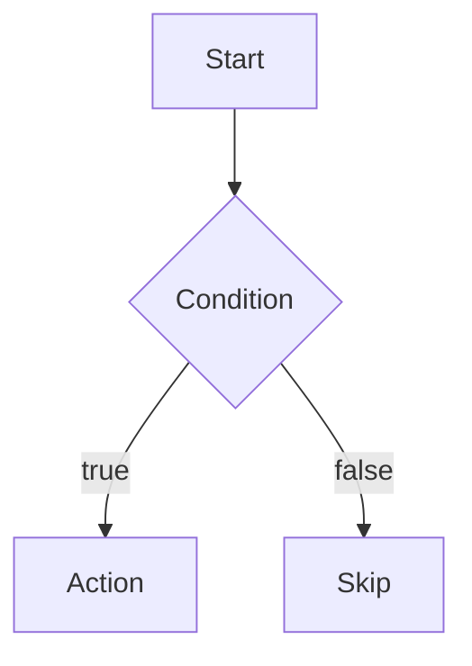

# Code Trace & Flow Visualization

## What I do

I analyze code and create visual flow diagrams showing:
- Execution paths step-by-step
- Where expected and actual behavior diverge
- Conditional branches and which are taken
- Event/callback sequences
- State changes through a flow

## What I need from you

1. **Code location**: Which file/function to analyze?
2. **Expected behavior**: What should happen?
3. **Actual behavior**: What's happening instead?
4. **Entry point**: Where does execution start?

## Diagram formats I use

### ASCII Tree (for linear flows with branches)

```
Entry Point
├─ Step 1
├─ Condition check
│  ├─ true → Step 2a
│  └─ false → Step 2b
└─ Exit
```

### Sequence Diagram (for multi-component interactions)

```
User → Form → Adapter → Concept → Storage
                 ↓
              Validation
```

### State Table (for before/after comparison)

```
| Step | Expected State | Actual State | Match? |
|------|----------------|--------------|--------|
| 1    | x=0            | x=0          | ✓      |
| 2    | x=1            | x=2          | ✗ ← divergence |
```

### Mermaid (for complex flows - renders in markdown)



## My process

1. **Read** the relevant code files you point me to
2. **Trace** from entry point through all branches
3. **Create diagram** showing the flow with appropriate format
4. **Mark divergence** points between expected and actual
5. **Suggest** specific lines/conditions to inspect

## When to use me

- Debugging unexpected behavior
- Understanding how existing code flows
- Planning changes by mapping current state
- Tracing event sequences across components
- Finding where expected and actual diverge

## For detailed pattern reference

See [PATTERNS.md](PATTERNS.md) for common flow patterns I can trace.
See [EXAMPLES.md](EXAMPLES.md) for concrete diagram examples.
